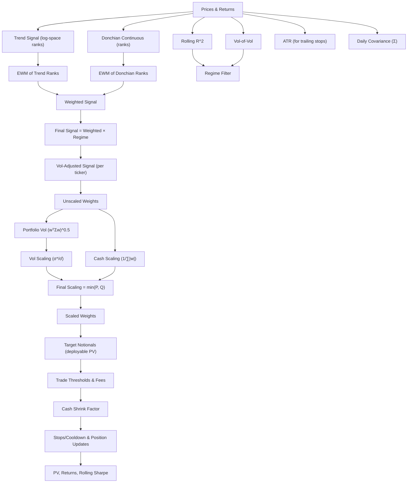

# Backtesting Framework Spec — Trend-Following (v0.1.0)

**Decision timing:** All signals and risk inputs are computed with data available at **t−1** and used to make decisions for **t** (next bar open).  
**Objective:** Produce daily target notionals per ticker consistent with a target-volatility portfolio, cash controls, stops/cooldowns, and fee/threshold rules—without look-ahead.

---

## Pipeline Overview


> If your renderer is older, switch the first line to `graph TD`.

---

## Step-by-Step Summary

### 1) Signal Construction (per ticker, computed at t−1)
- **Trend (log-space)** → percentile ranks → **EWM** of ranks.  
- **Donchian (continuous distance-to-band)** → percentile ranks → **EWM** of ranks.  
- **Weighted blend:** `weighted = w_trend·trend_ewm + w_dc·donchian_ewm` (w_trend + w_dc = 1).  
- **Rolling R^2** (trend strength) and **Vol-of-Vol** (instability) → combine into **Regime filter** (AND or continuous product).  
- **Final signal:** `final = weighted × regime`.  
- **Long-only (if enabled):** clamp negatives to 0.  
- Compute for **all tickers** in the portfolio.

### 2) Volatility-Adjusted Signal → Unscaled Weights
- Convert `final` to preliminary risk weights, e.g. `unscaled_w_i = final_i / max(vol_i, ε)` using a volatility window.  
- Ensure no look-ahead; NaN until warmup satisfied.

### 3) Risk Inputs
- **ATR**: rolling ATR (window w_ATR) for trailing stop logic.  
- **Covariance Σ**: rolling covariance of daily returns (window w_cov). Ensure Σ is PSD (or project/shrink to PSD).

### 4) Target-Vol Sizing & Cash Buffer
- **Daily target vol:** `σ* = annual_target_vol / sqrt(annual_trading_days)`.
- **Portfolio vol:** `σ̂ = sqrt(w_unscaledᵀ Σ w_unscaled)`.
- **Vol scaling:** `s_vol = σ* / max(σ̂, ε)`.
- **Cash scaling:** `s_cash = 1 / max(∑_i |w_unscaled_i|, ε)`.
- **Final scaling:** `s_final = min(s_vol, s_cash)`.
- **Deployable PV:** `PV_deploy = (1 − cash_buffer_pct) × PV_start_of_day`.
- **Scaled weights:** `w_scaled_i = s_final × w_unscaled_i`.
- **Target notional:** `target_i = w_scaled_i × PV_deploy`.

### 5) Trade Construction, Thresholds & Fees
- **Current notional:** `curr_i = position_size_{t-1,i} × open_{t,i}`.
- **New trade notional:** `trade_i = target_i − curr_i`.
- **Thresholds:**
  - Portfolio threshold: `PV_thresh = notional_threshold_pct × PV_{t-1}`.
  - Per-ticker threshold: `Tk_thresh_i = notional_threshold_pct × |target_i|`.
  - Absolute minimum: `Abs_min` (e.g., $10).
- **Eligibility:** trade only if `|target_i| > max(PV_thresh, Tk_thresh_i, Abs_min)`.
- **Fees:** estimate maker/taker-based fees; `trade_net_i = trade_i − fee_i`.
- **Aggregate cash:** compute **net cash need** across all tickers (debits − credits).

### 6) Cash Shrink Factor
- **Available cash (buffered):** `cash_avail_t = cash_{t-1} × (1 − cash_buffer_pct)` (or your policy).  
- **Shrink factor:** `s_shrink = min(1, cash_avail_t / max(net_cash_need, ε))`.  
- **Apply to trades:** `trade_final_i = s_shrink × trade_net_i`.

### 7) Execution, Stops, Cooldown, Accounting
- **Roll positions:** copy t−1 “open positions” to today’s open before applying trades.
- **Cooldown:** if active and counter < threshold → **skip** ticker.  
- **Stop breach at open:** compare today’s open to yesterday’s trailing stop.
  - Breach → flatten position; set cooldown counter = 1.  
- **Zero target handling:** if target ≈ 0 → flatten gracefully.
- **Execute:** update actual position notionals = open notional + `trade_final`.  
- **Update stops:** recompute trailing stop for active positions (longs vs shorts policy).  
- **Update cash and short-sale proceeds** (if shorts supported).  
- **Register events** (entries, exits, stops, cooldown toggles).

### 8) Mark-to-Market & KPIs
- **PV update:** `PV_t = cash_t + Σ_i position_size_{t,i} × close_{t,i}`.
- **Return:** `ret_t = (PV_t − PV_{t-1}) / PV_{t-1}`.
- **Rolling Sharpe:** compute on `ret_t` over chosen window (document window & risk-free assumption).

---

## Core Formulas (reference)

```text
σ* = annual_target_vol / sqrt(annual_trading_days)
σ̂ = sqrt(w_unscaledᵀ Σ w_unscaled)
s_vol = σ* / max(σ̂, ε)
s_cash = 1 / max(∑|w_unscaled|, ε)
s_final = min(s_vol, s_cash)
PV_deploy = (1 − cash_buffer_pct) × PV_start_of_day
target_i = s_final × w_unscaled_i × PV_deploy
trade_i = target_i − (position_size_{t-1,i} × open_{t,i})
s_shrink = min(1, cash_avail_t / max(net_cash_need, ε))
trade_final_i = s_shrink × (trade_i − fee_i)
```

---

## Daily Run Order (canonical)
1. Build all **signals** and **filters** at t−1; compute **final** signal.  
2. Map to **unscaled weights**; compute **ATR** and **Σ** at t−1.  
3. Apply **target-vol sizing** and **cash buffer** → **target notionals**.  
4. Apply **thresholds & fees** → preliminary trades; compute **net cash need**.  
5. Apply **cash shrink** → final trades.  
6. **Cooldown/stop checks** at open; execute trades; update **positions/cash/stops**.  
7. **Mark-to-market** at close; compute **PV, returns, Sharpe**; persist artifacts.

---

## Invariants & Checks
- **No look-ahead:** all decision inputs are t−1.  
- **Cash conservation:** cash + positions reconcile daily (tied to trade & fee accounting).  
- **Thresholds suppress dust trades**; absolute minimum enforced.  
- **Σ PSD:** covariance is PSD (or projected/shrunk to PSD).  
- **Warmups respected:** signals/ATR/covariance NaN until windows filled.  
- **Determinism:** identical inputs → identical outputs.  
- **Logging:** record parameters, scaling factors, thresholds, fees, and shrink factor each day.

---

## Run Manifest (example keys)
```yaml
run_id: "2025-09-20_backtest_v0.1"
universe: ["BTC-USD","ETH-USD","SOL-USD","ADA-USD","AVAX-USD"]
params:
  mavg_start: 20
  mavg_end: 200
  mavg_stepsize: 8
  mavg_z_score_window: 126
  entry_rolling_donchian_window: 56
  volatility_window: 30
  rolling_cov_window: 20
  rolling_atr_window: 20
  atr_multiplier: 2.5
  annual_trading_days: 365
  annualized_target_volatility: 0.55
  cash_buffer_pct: 0.10
  notional_threshold_pct: 0.02
  min_trade_notional_abs: 10
  cooldown_counter_threshold: 3
fees:
  maker: 0.006
  taker: 0.012
  passive_trade_rate: 0.05
execution:
  decision_price: "next open"
  shift_bars: 1
data:
  timezone: "UTC"
  source: "Coinbase"
  snapshot_end: "2025-07-31"
```

---

**Notes**
- Replace any placeholders (e.g., exact rank/ATR definitions, stop update rule) with your final choices.  
- If you later enable shorts on spot (synthetic), add explicit short cash/proceeds rules and borrow costs.
