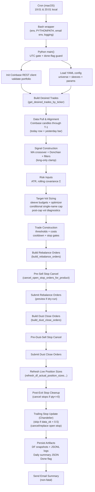

# Live Strategy Runbook & Flow — Trend Following (v0.2.0 live)

**Decision timing:** All signals and risk inputs are computed with **fully-formed T−1 daily bars** and used to decide/execute on the next run.  
**Objective:** Produce daily target notionals per ticker consistent with target-vol portfolio sizing, sleeve risk budgets, concentration controls, cooldown/stops, trade thresholds, and execution rules — *without look-ahead* — and keep every open position protected by a stop.

> This document mirrors the structure and clarity of the backtesting spec you created (pipeline overview → step-by-step → invariants/checks), but adapted to the live Coinbase workflow.

---

## Entry Points (How the job runs)

### A) Cron (macOS / DST-safe pattern)
Because macOS cron cannot reliably set `TZ=UTC`, schedule **two** local-time triggers (EST vs EDT) and gate inside the Python runner:
- `19:01` local
- `20:01` local

Only the one that corresponds to **00:01 UTC** will run; the other will exit via the UTC gate.

### B) Daily bash script
`trend_following_v020_live_daily_script.sh`:
- sets `REPO_ROOT`, `PYTHONPATH`, locale
- loads email env (`$HOME/tf_email.env`) if present
- runs the live orchestrator:
  - `--run-at-utc-hour 0 --gate-minutes 5`
  - appends stdout/stderr to `live_run.log`
  - writes `cron_env_debug.log` for debugging cron environments

### C) Python orchestrator
`trend_following_v020_live.py` performs the full pipeline:
- UTC gate + “already ran today” guard
- config load
- Coinbase client init
- desired trades (signals + sizing + gates)
- order build + submit
- dust close + submit
- refresh live positions
- stop cleanup and trailing stop updates
- write daily summary + email
- write done flag

---

## Pipeline Overview (Mermaid)



> If your Mermaid renderer is older, replace `flowchart TD` with `graph TD`.

---

## Step-by-Step Run Order (Canonical)

### 0) UTC Gate + “Already Ran” Guard
**Purpose:** Prevent accidental multiple runs and enforce a deterministic run window.  
**Logic:**
- If `--force-run` is not set:
  - Require `now.hour == run_at_utc_hour` and `0 <= now.minute <= gate_minutes`
  - If not, exit and log `gate_skip`
- If `today.done` exists (and not `--force-run`), exit and log `already_ran`

**Output:** One run per UTC day (unless forced).

---

### 1) Load Config (YAML)
**Inputs:** `trend_strategy_config_v020.yaml`  
**Extracts:**
- portfolio name (Coinbase portfolio)
- universe tickers + sleeve budgets
- signal params (MA crossover, Donchian, filter params)
- risk & sizing params (target vol, windows, ATR, cap params)
- execution params (cost estimate, passive trade rate, thresholds, min notional, cooldown threshold)

**Output:** `cfg`, `ticker_list`, `ticker_to_sleeve`

---

### 2) Initialize Coinbase Client
**Purpose:** Validate connectivity and portfolio UUID before doing any work.  
**Output:** `client`

---

### 3) Data Pull & T−1 Alignment
**Purpose:** Ensure no partial daily candle look-ahead.  
**Policy:** pull candles **through yesterday**, then shift so “today row” reflects yesterday’s fully-formed bar.

**Data-quality gate:**
- maintain a per-ticker `*_data_ok` flag
- later stages (notably stop updates) may **skip** updates if market data is incomplete

**Outputs:**
- daily OHLCV aligned to run date
- `*_data_ok` flags

---

### 4) Signal Construction (per ticker, computed on T−1 bars)
**Components (as configured):**
- MA crossover signal (fast/slow, with steps / ribbons)
- Continuous Donchian distance-to-band signal (entry/exit windows, shift)
- Weighted blend:
  - `weighted = w_ma * ma_signal + w_dc * donchian_signal`
  - optional EWM smoothing window
- Filters:
  - rolling R² (trend quality)
  - vol-of-vol (instability)
- Final signal:
  - `final = weighted × filter` (binary or continuous)
  - long-only clamp (negatives → 0)

**Output:** per-ticker `final_signal`

---

### 5) Risk Inputs
**Purpose:** Build the risk model and stop risk metric.
- **ATR** (rolling window) for Chandelier stop logic
- **Covariance Σ** (rolling window) for portfolio volatility calculation

**Output:** `ATR_i`, `Σ`

---

### 6) Target-Volatility Position Sizing + Concentration Controls
**Purpose:** Convert signals to target notionals, respecting sleeve budgets and avoiding single-name concentration.

Typical sequence:
1. Sleeve risk budgeting / optimizer: allocate signal risk across sleeves within tolerance.
2. Convert to an unscaled risk mix.
3. Compute portfolio vol `σ̂ = sqrt(wᵀ Σ w)` and scaling `s_vol = σ* / max(σ̂, ε)`.
4. Apply cash/constraint scaling (no leverage).
5. Apply **conditional single-name cap**:
   - cap tight when breadth is low (`n_eff` below threshold)
   - cap looser when breadth increases
6. Redistribution loop: push leftover gross into remaining headroom if possible.
7. Record **pre-cap and post-cap** realized-vol diagnostics.

**Output:** target notionals per ticker (or equivalent per-ticker deltas) + diagnostics.

---

### 7) Desired Trades + Safety Gates
`get_desired_trades_by_ticker(...)` should produce:
- `desired_positions[ticker]["new_trade_notional"]`
- `reason` (e.g., threshold pass / skip / cooldown / stop gate)
- a runtime dataframe `df` with columns like:
  - `*_stop_loss` (record-only stop level used for logic)
  - `*_cooldown_counter`
  - `*_event`
  - `*_data_ok`

**Gates that must hold (high level):**
- **Cooldown:** if a ticker is cooling down, do not initiate or re-add risk.
- **Stop gate:** do not open new risk when stop placement would be invalid (e.g., stop above market for a long).
- **Thresholds:** suppress dust/trivial rebalances.

**Outputs:** `df`, `desired_positions`, `current_positions`

---

### 8) Build Rebalance Orders
`build_rebalance_orders(...)` converts desired notionals into exchange orders.
- Market orders by default
- Produces a list of order dicts for submit

**Output:** `rebalance_orders`

---

### 9) Cancel Stops Before SELL Orders (Critical Live Safety)
**Why:** open STOPs can reserve base units and cause SELLs to fail (Available=0).  
**Action:** for any product with a SELL order, cancel open STOP orders first.

**Output:** stop-cancel audit logs (`STOP_UPDATE_LOG`)

---

### 10) Submit Rebalance Orders
- If `--dry-run`, submit as preview (no live placement)
- Else, submit live

**Output:** order submit logs (`ORDER_SUBMIT_LOG`) + run error collection if failures occur

---

### 11) Dust Close Orders
**Purpose:** clean up small residual positions cost-effectively.
- Build dust orders with max-cost guard
- Cancel stops before dust SELL orders (same available issue)
- Submit dust orders

**Outputs:** dust build/submit logs

---

### 12) Refresh Live Position Sizes
**Purpose:** stops must be sized off **current holdings**, not stale pre-trade holdings.  
**Action:** refresh dataframe position sizes from live Coinbase portfolio.

**Output:** `df` updated with actual post-trade sizes.

---

### 13) Post-Exit Stop Cleanup
If a ticker was sold down to zero, ensure any remaining STOP orders are cancelled.

---

### 14) Trailing Stop Update (Chandelier)
For each ticker:
1. **Stop-update data gate:** if `*_data_ok < 0.5`, do **not** cancel/replace stops; skip.
2. Compute desired stop:
   - e.g., `stop = highest_high(N) - ATR(M) * atr_multiplier`
3. Cancel/replace any existing stop order as needed
4. Record action + status (`placed` / `skip` / `not_open`) and any reject messages.

**Output:** stop update results per ticker.

---

### 15) Persist Artifacts + Email
Write the authoritative daily summary (JSON) and then email it.
- Email failures are **non-fatal** (logged but don’t crash the run)
- Write done flag for the day

---

## Persisted Artifacts (What to look at when debugging)

### Logs (JSONL)
- Desired trades: why each ticker traded or was skipped
- Order build: exact orders constructed
- Order submit: exchange responses (live or preview)
- Stop updates: cancel/replace actions + statuses
- Live errors: caught exceptions with context

### Snapshots
- Dataframe snapshots by stage:
  - `post_desired_trades`
  - `post_refresh_positions`
  - `final`

### Daily Summary (authoritative)
- `daily_summary_YYYY-MM-DD.json` is your “single source of truth” for the day’s run.

### Done Flag
- prevents multiple runs per UTC day unless forced.

---

## Invariants & Checks (Production Safety)

1. **No look-ahead:** all signals and risk inputs must be T−1.
2. **One run per UTC day:** enforced by UTC gate + done flag.
3. **No leverage:** scaling bounded (gross exposure constrained by cash rules).
4. **Concentration control:** conditional cap prevents over-allocation to a single name.
5. **Stops always present for open positions:**
   - cancel-before-sell prevents execution failures
   - post-exit cleanup prevents orphaned stops
   - stop-update skip on bad data prevents removing protection accidentally
6. **Determinism:** given same inputs and portfolio state, the run is reproducible (within exchange fills).
7. **Auditability:** every order/stop action has a log record + daily summary.

---

## Operations

### Manual run (live)
```bash
/opt/anaconda3/envs/crypto_prod/bin/python \
  /Users/adheerchauhan/Documents/git/trend_following/live_strategy/trend_following_strategy_v020_live/trend_following_v020_live.py \
  --run-at-utc-hour 0 --gate-minutes 5
```

### Manual run (forced, ignores gate + done-flag)
```bash
/opt/anaconda3/envs/crypto_prod/bin/python \
  .../trend_following_v020_live.py \
  --force-run
```

### Manual run (preview / dry-run)
```bash
/opt/anaconda3/envs/crypto_prod/bin/python \
  .../trend_following_v020_live.py \
  --dry-run --force-run
```

---

## Common Failure Modes & Expected Behavior (Quick Reference)

- **Cron fires at the “wrong” local time:** Python exits cleanly with `gate_skip`.
- **Cron runs twice in one UTC day:** Python exits cleanly with `already_ran` unless forced.
- **SELL fails due to reserved inventory:** mitigated by canceling open stops before sells.
- **Missing OHLC for a ticker:** stop updates are skipped; no cancel/replace occurs.
- **Email fails:** logged; run still completes and writes daily summary + done flag.

---

## Suggested Tests (Before/After any changes)

1. **Dry-run sanity:** desired trades + orders + stop plans look reasonable.
2. **Stop integrity:** for every open position, ensure at least one OPEN stop exists after the run.
3. **Cap behavior:** confirm names are capped when breadth is low; check post-cap vol diagnostics.
4. **T−1 integrity:** verify the row used for decisions corresponds to yesterday’s candle values.
5. **End-to-end replay:** run on a known day with saved data and compare artifacts.

